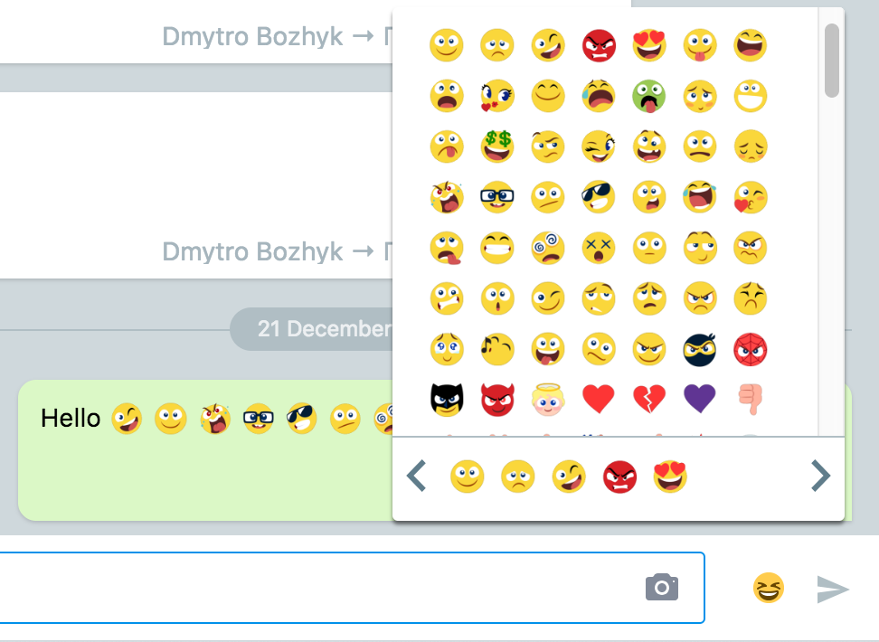

# react-viber-emoji
Don't you spend a single day hanging with your chat pals while sharing Viber lovely emojies? Can't live live without adorable Viber emojies? 
This repository contains a script that generates an emojie image based on a Viber emojie code (smiley).
Finally get them on your server and start building your own web apps using easy to install ready-to-use library.

Features:
- renders Viber emojies out of the box;
- latest list of emojies is included;
- easy to use or fork;
- simple functional API;
- emojie images are Viber native;

